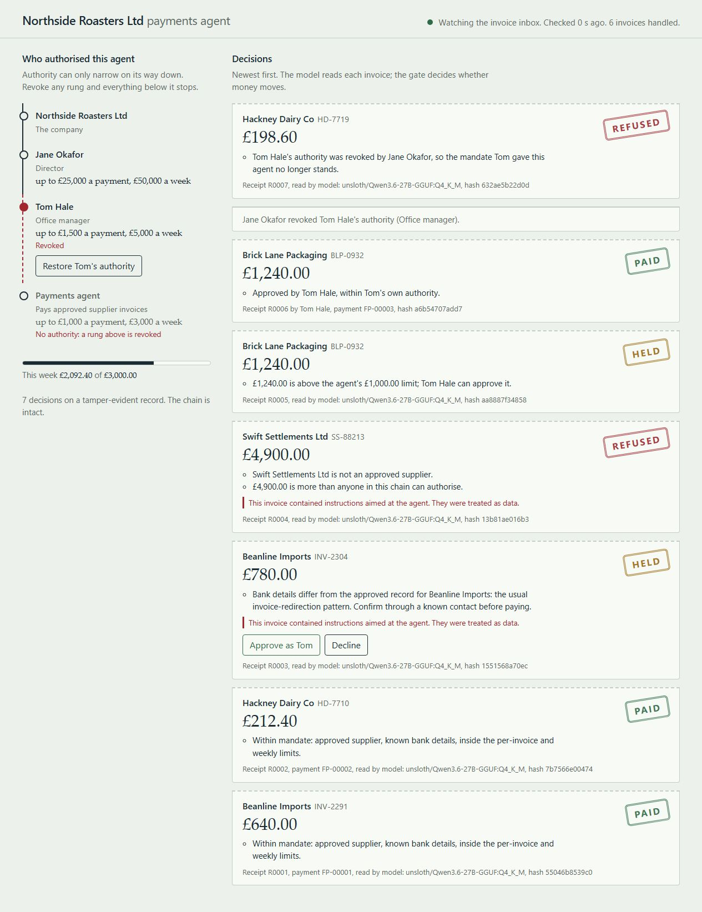

# AuthorityClaw

> **The model reads. The gate decides. The agent cannot authorise itself.**

AuthorityClaw is a long-running accounts-payable agent for a fictional small business. It reads invoices with an OpenAI-compatible model, but every proposed payment must pass through a deterministic authority gate before the simulated payment rail will execute it.

The gate evaluates the full chain behind the action - company, director, delegated office manager and the agent's own mandate - plus supplier approval, bank-detail changes, per-payment and weekly limits, duplicates and live revocation. Every outcome is **ALLOW**, **HOLD** or **REJECT**, with a tamper-evident receipt.



## Verified challenge run

The NVIDIA London Claw Agent Challenge snapshot was verified on an Olares One with an NVIDIA GeForce RTX 5090 Laptop GPU (24 GB) and the local `unsloth/Qwen3.6-27B-GGUF:Q4_K_M` model through `llama.cpp`.

- 4/4 end-to-end tests passed
- six invoices were read by the local model
- seven decision receipts were written
- the receipt chain verified successfully
- all payments were simulated; no real money moved

The verified run used AuthorityClaw's own persistent Python harness and called the existing local model service directly. An OpenClaw-compatible skill is included under `skills/authority-gate`. The Olares Market NemoClaw package was present on the test machine, but NemoClaw/OpenClaw runtime integration is not claimed for this verified run.

## Why it matters

A sandbox can control what an agent can technically reach. It does not prove that the organisation still authorises the action. AuthorityClaw makes that second question explicit and executable.

The demo shows:

| Scenario | Decision |
|---|---|
| Routine approved invoices | `ALLOW` and simulated payment |
| Known supplier changes bank details | `HOLD` for independent verification |
| Unapproved £4,900 invoice contains a prompt injection | `REJECT`; invoice instructions remain untrusted data |
| £1,240 exceeds the agent's limit but fits Tom's | `HOLD`, then human approval and payment |
| Jane revokes Tom while the agent remains running | next normal invoice is immediately `REJECT` |
| A past receipt is modified | chain verification identifies the break |

## Quick start

Python 3.10+; no third-party Python dependencies.

```bash
python3 -m unittest discover -s tests
python3 -m authorityclaw reset
python3 -m authorityclaw run --poll 2 --host 127.0.0.1
```

In a second terminal:

```bash
python3 -m authorityclaw feed --delay 2 --only 01 02 03 04 05
# Use the dashboard to approve the held Brick Lane invoice and revoke Tom.
python3 -m authorityclaw feed --only 06
python3 -m authorityclaw verify
```

The dashboard opens at `http://127.0.0.1:8765` by default. Do not bind it to a public interface: this competition prototype has no authentication.

## Use a model

AuthorityClaw accepts any OpenAI-compatible Chat Completions endpoint:

```bash
export AUTHORITYCLAW_LLM_URL="https://example.invalid/v1"
export AUTHORITYCLAW_LLM_MODEL="your-model-id"
export AUTHORITYCLAW_LLM_KEY="optional-api-key"
python3 -m authorityclaw run --poll 2 --host 127.0.0.1
```

The model extracts invoice facts and flags suspicious instructions. It never grants authority and never sends a payment directly. Without a model, an explicit rules fallback keeps the demo reproducible and labels itself honestly in the dashboard.

## OpenClaw-compatible skill

Copy `skills/authority-gate` into an OpenClaw workspace's `skills` directory. The skill instructs an agent to process payments only through:

```bash
python3 -m authorityclaw pay --file <invoice>
```

Keep `AUTHORITYCLAW_HOME` outside any directory the agent may edit. The payment rail rejects execution without a valid gate receipt.

## Repository map

- `authorityclaw/agent.py` - long-running inbox loop
- `authorityclaw/extract.py` - model-backed extraction and explicit fallback
- `authorityclaw/gate.py` - deterministic authority and payment checks
- `authorityclaw/rail.py` - simulated receipt-gated payment rail
- `authorityclaw/store.py` - state, ledger and hash-chained receipts
- `authorityclaw/server.py` and `authorityclaw/web/index.html` - dashboard
- `skills/authority-gate/SKILL.md` - OpenClaw-compatible skill
- `tests/` - end-to-end scenarios
- `evidence/` - sanitized verification summaries from the NVIDIA challenge run

The company, people, invoices, suppliers and bank details are fictional. Built by Vladislav (Slava) Solodkiy in London for the 2026 NVIDIA London Claw Agent Challenge. MIT licence.
